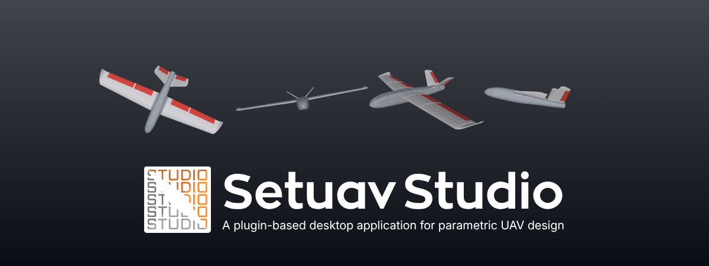
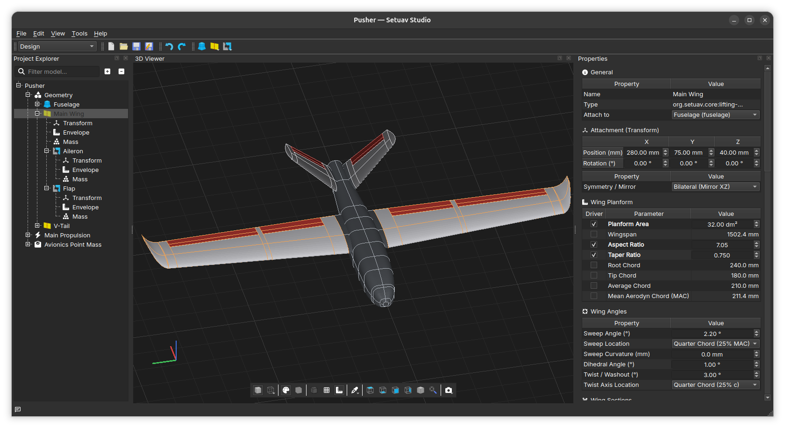
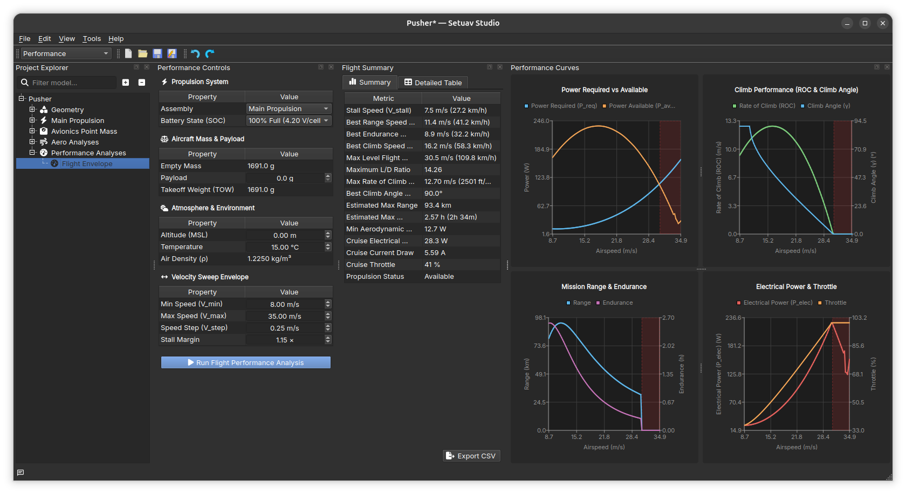

<p align="center">
  
</p>

<p align="center">
  <a href="https://github.com/Setuav/studio/actions/workflows/ci.yml">
    
  </a>
  <a href="https://github.com/Setuav/studio/actions/workflows/ci.yml">
    
  </a>
  <a href="https://github.com/Setuav/studio/actions/workflows/dependency-audit.yml">
    
  </a>
  <a href="https://github.com/Setuav/studio/releases">
    
  </a>
  <a href="https://pypi.org/project/setuav-studio-sdk/">
    
  </a>
  <a href="LICENSE">
    
  </a>
  
</p>

**Setuav Studio** brings geometry design, engineering analysis, and project data into
one extensible desktop workspace. It is built with Python and PySide6 and uses a
plugin architecture so design and analysis capabilities can evolve independently.

<table>
  <tr>
    <td align="center"></td>
    <td align="center"></td>
  </tr>
  <tr>
    <td align="center"><em>Design workspace</em></td>
    <td align="center"><em>Performance workspace</em></td>
  </tr>
</table>

## Features

- Parametric fuselage, lifting-surface, and control-surface design.
- Interactive OpenGL geometry viewer with selection and section editing.
- Aerodynamic analysis, stability results, polar charts, airfoil tools, and a
  native AeroSandbox VLM viewer.
- Electrical propulsion modeling and result visualization.
- Flight-performance envelope analysis.
- Weight-and-balance analysis with component-level mass properties.
- Extensible workspaces, panels, tools, component editors, and project schemas.
- Folder, `project.json`, and portable `.suav` project support.

## Quick start

Requires Python 3.11 or newer, [`uv`](https://docs.astral.sh/uv/) for locked
dependency management, and a desktop environment supported by PySide6. The
aerodynamics extra installs AeroSandbox and PyVista; these dependencies are
included by `--all-extras` in the commands below.

Clone the repository and install the locked runtime environment:

```bash
git clone https://github.com/Setuav/studio.git
cd studio
uv sync --locked --all-extras
```

Start the application:

```bash
uv run --locked setuav-studio
```

Open an existing project directly:

```bash
uv run --locked setuav-studio path/to/project
uv run --locked setuav-studio path/to/project.suav
```

## Documentation

- [User guide](docs/index.md)
- [Developer documentation](docs/developer/index.md)

## Development

Install the development dependencies:

```bash
uv sync --locked --all-extras --group dev
```

Run the code checks and test suite:

```bash
uv run --locked pre-commit run --all-files
uv run --locked python -m tests.suites all
```

Run the standalone SDK contract and example-plugin tests separately:

```bash
uv run --locked python scripts/sdk_contract_tests.py
```

Automatic checks before each commit can be enabled optionally:

```bash
uv run --locked pre-commit install
```

Tests can also be run for a single area while developing:

```bash
uv run --locked python -m tests.suites geometry
uv run --locked python -m tests.suites aerodynamics
```

Run `uv run --locked python -m tests.suites --help` to list all test groups.

## Desktop build

Create a local PyInstaller build:

```bash
uv sync --locked --all-extras --group desktop
uv run --locked --all-extras --group desktop \
  pyinstaller --noconfirm --clean setuav-studio.spec
```

The application is created under `dist/setuav-studio/`. CI runs the full package,
startup, security, and dependency checks automatically.

## Plugin development

Plugins extend Setuav Studio through the `StudioAPI`. A plugin can register
workspaces, panels, toolbar actions, tools, component editors, project schemas,
geometry providers, and project-tree nodes. Each plugin owns its activation and
cleanup lifecycle, allowing capabilities to be added without changing the
application core.

At runtime, use **Tools → Plugin Manager** to review active plugins and any
discovery or activation issues. User plugins can be enabled or disabled from
the same screen; the core plugin remains protected.

With MkDocs, Doxygen, and Graphviz installed, generate the documentation site:

```bash
mkdocs build
```

The build hook runs Doxygen and places the SDK reference under
`Developer Guide → SDK API Reference`. Open `build/docs/site/index.html` in a
browser to view the site.

## License

Setuav Studio is released under the [MIT License](LICENSE).
