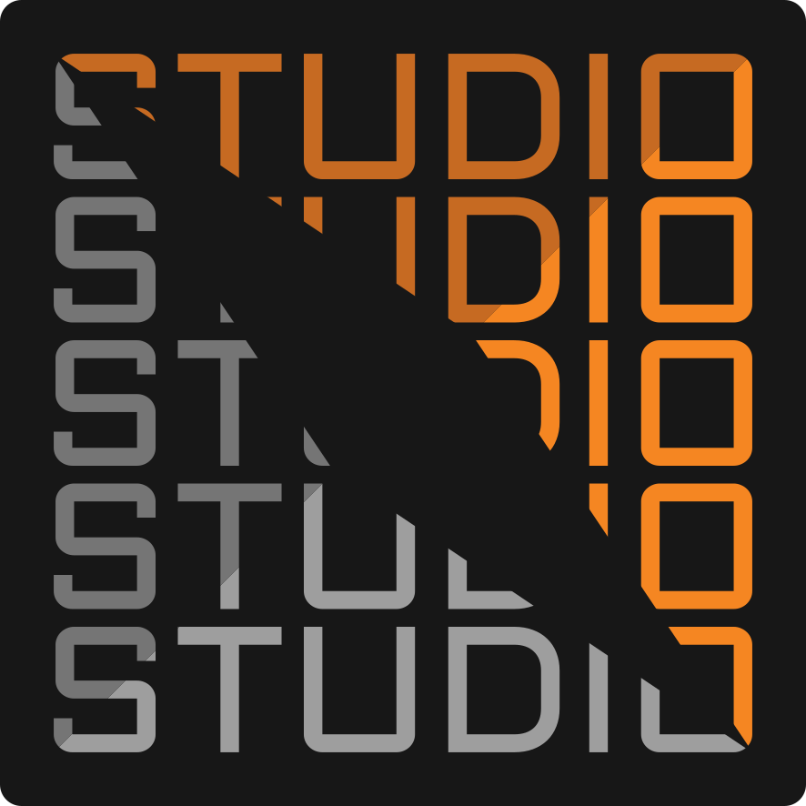

# Setuav Studio

Welcome to the official documentation for **Setuav Studio**, a plugin-based
desktop application for parametric UAV design and analysis.

Setuav Studio brings geometry design, engineering analysis, and project data
into one extensible workspace. It is built with Python and PySide6 and exposes
a public SDK for third-party plugins.

## Documentation sections

- [Getting Started](user-guide/getting-started.md) — install the application and
  open your first project.
- [Workspaces](user-guide/workspaces.md) — learn the five application workspaces.
- [Plugin Manager](user-guide/plugins.md) — manage installed plugins.
- [Developer Guide](developer/index.md) — build plugins against the public SDK.
- [SDK API Reference](developer/sdk-api-reference.md) — browse the generated
  Doxygen reference.
