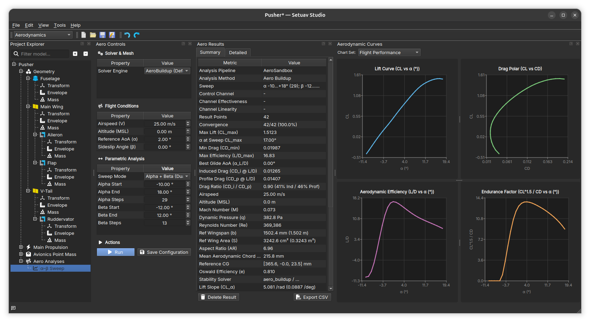
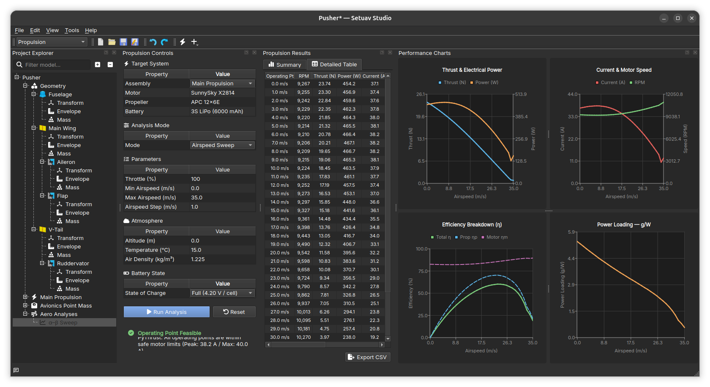
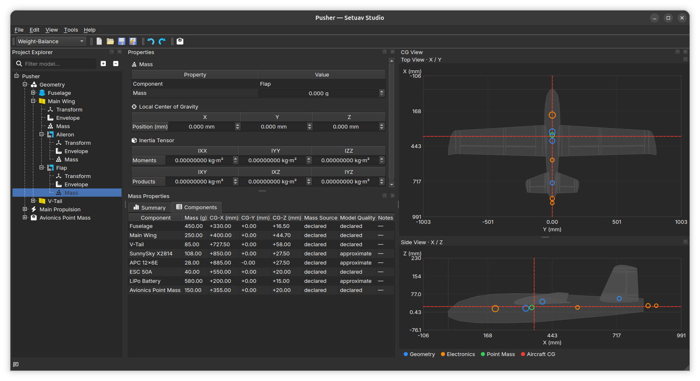

# Setuav Studio User Guide

Setuav Studio is a workspace-based desktop application for designing and
analysing UAV projects. Select a workspace from the selector in the top
toolbar; each workspace provides the panels and tools needed for one part of
the workflow.

## Application layout

The Design workspace combines the Project Explorer, 3D Viewer, and Properties
panel. Select an item in the project tree to inspect or edit it; changes are
written to the open project and can be undone from the Edit menu.

## Workspaces

### Design

Use Design to build the airframe and inspect it in 3D. The Project Explorer
contains geometry, propulsion, avionics, and saved analysis results. Selecting a
component opens its properties on the right.

### Aerodynamics

Aerodynamics configures and runs aerodynamic analyses. The workspace shows the
analysis controls, saved result summary, and the generated lift, drag,
efficiency, and endurance curves.

### Performance

Performance evaluates the aircraft across an airspeed sweep. Configure the
aircraft, atmosphere, and velocity envelope in the controls panel, then review
the flight summary and performance curves.

### Propulsion

Propulsion models the selected motor, propeller, battery, and propulsion
assembly. Run an airspeed or operating-point analysis to populate the results
table and thrust, power, current, RPM, efficiency, and power-loading charts.

### Weight-Balance

Weight-Balance displays component masses, centers of gravity, and inertia data.
Use the CG views to inspect the aircraft in top and side projections while
reviewing the mass-properties table.

## Project files

Projects can be opened as a project folder, a `project.json` file, or a
portable `.suav` archive. Use **File → Open Project** or pass a project path to
`setuav-studio` on the command line.

## Undo and save

Use **Edit → Undo** and **Edit → Redo** for project changes. **File → Save**
writes the current project in its existing format; **Save As** creates a new
project file or archive.

## Plugin Manager

Open **Tools → Plugin Manager** to inspect discovered plugins and their load
issues. Use the checkbox in the Enabled column to deactivate or reactivate a
user plugin. The core plugin cannot be disabled.

For plugin development and the public SDK contracts, see the [Developer
documentation](../api/index.md).
